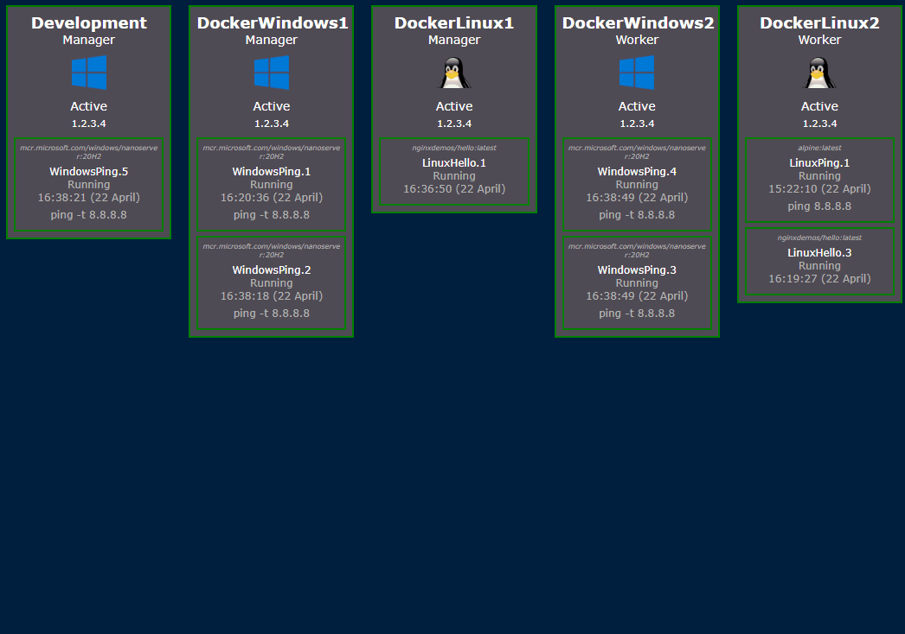

# SwarmWatch🕵️

SwarmWatch is a project for visualizing Docker Swarms.

### Requirements

- An initialized swarm
- A Manager node running on Linux

### Build & Deploy

- ``docker-compose build``
- ``docker stack deploy --compose-file docker-compose.yml SwarmWatch``
- Visit ``http://127.0.0.1:81``
- For redundancy, you can either update replicas in ``docker-compose.yml`` to 2, or
  do ``docker service scale SwarmWatch_swarmwatch=2``. Please note to get any real benefit from this
  you need multiple Manager nodes running on Linux.

### Disclaimer
For two main reasons this should not be exposed to the internet. It is a tool for monitoring development/staging environments, rather than production.

- It is using Flask's built-in WSGI which has had known vulnerabilities
- It exposes the docker socket inside the container

